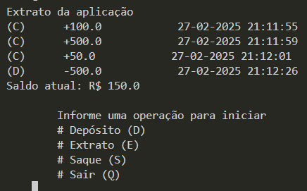
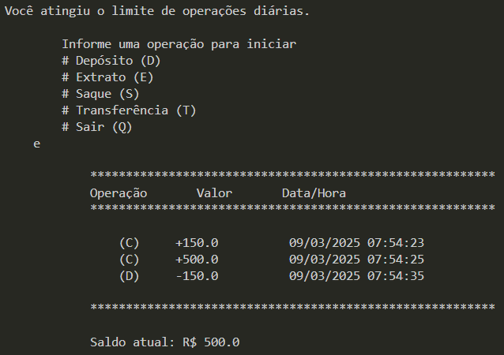

# Sistema PythonBank
Operações implementadas:
* Depósito
* Saque
* Extrato

### Depósito
Depósito de valores positivos e sem especificar qual usuário está realizando a operação, apenas os valores.
O histórico de operações deve ficar armazenado

### Saque
Apenas 3 saques diários e 500 reais por saque.
O histórico de saque deverá ficar armazenado para exibição no extrato.

### Extrato
Exibir todas as operações com o valor total ao final da exibição, com o formato R$XX.XXX,XX

### Implementação de Transferência e limite de 10 operações por dia
